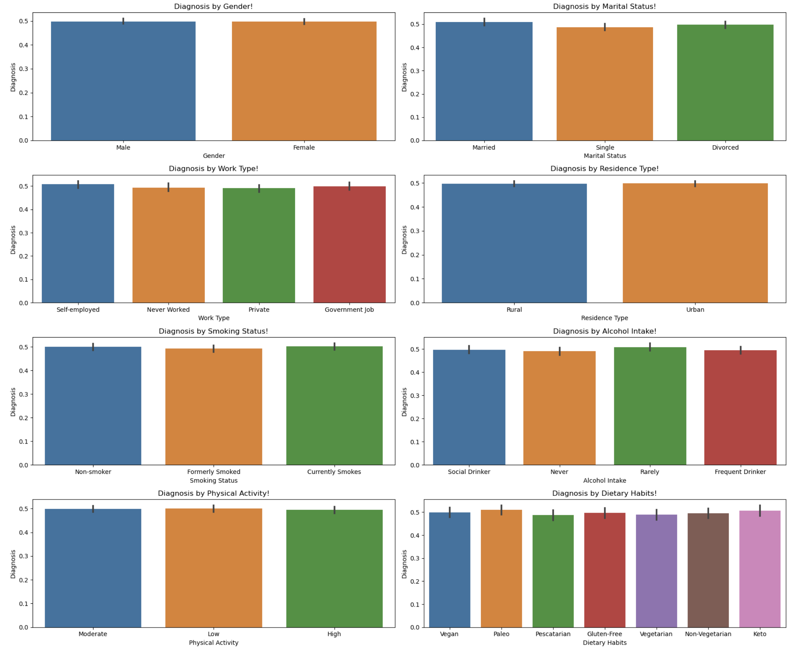
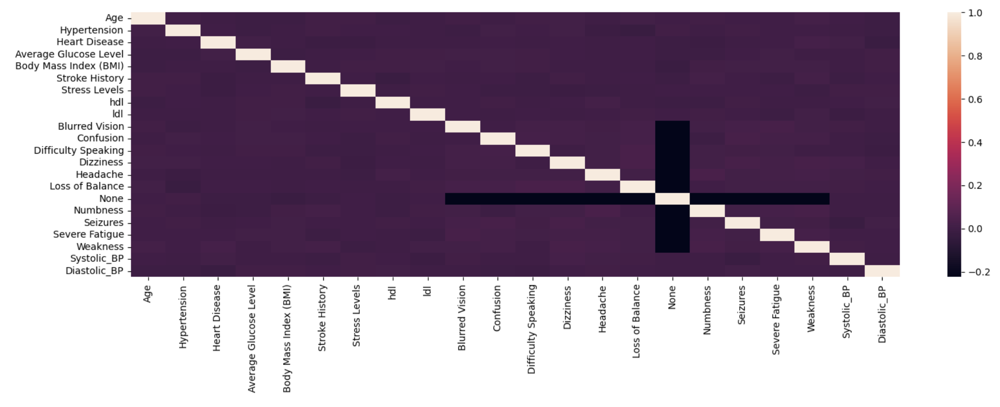
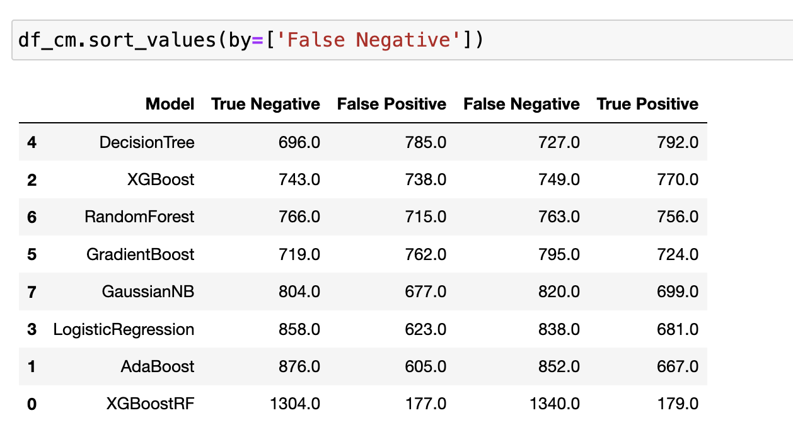
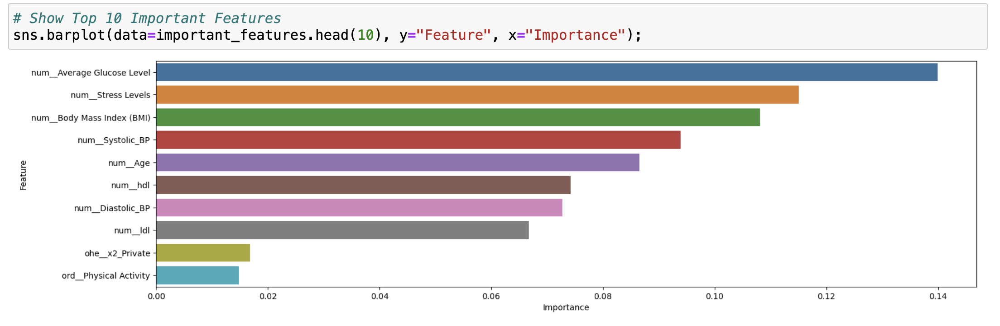
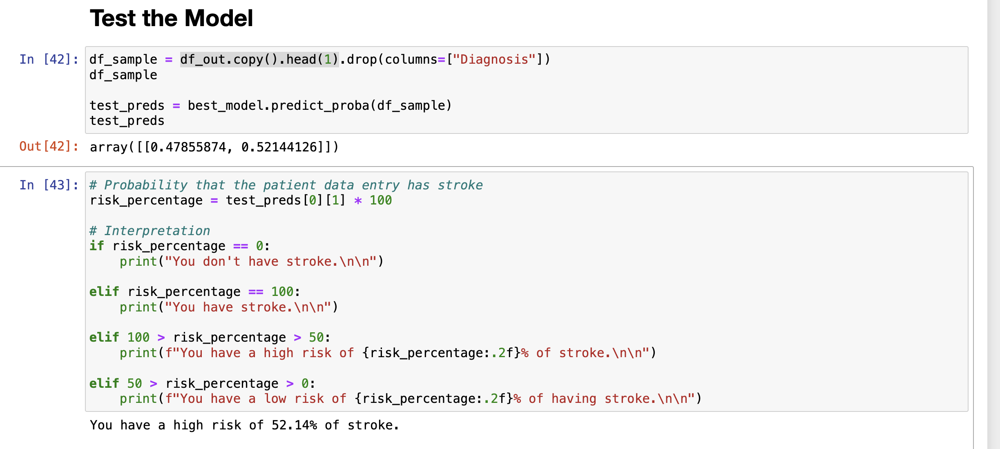

# Stroke Detection

** [Image Source](https://vitals.sutterhealth.org/stroke-and-heart-attack-rapid-response-timing-is-everything/)

**Author**

Sridhar Subramaniam

#### Executive summary
This projects explores building a best machine learning model that could diagnose the stroke using given patient data. By understanding Patient lifecycle, age and symptoms, this model could help doctors diagnose the stroke with better accuracy. This project involves the analysis of historical data, application of various regression models, and in-depth feature engineering and to provide actionable insights to both technical and non-technical stakeholders.

#### Rationale
Why should anyone care about this question?

Stroke need to diagnosed quickly to react and save patient's life. Machine learning can provide early automated diagnosis of stroke using patient's lifecycle, age and symptoms that enable Doctors to act quickly to save patient life. 

#### Research Question
What are you trying to answer?

Can regression & classification techniques detect the diagnosis of stroke based on patients data ?

#### Data Sources
What data will you use to answer you question?

In this exploration, a open data set for stroke predication from Kaggle is used. Can be downloaded [here](https://www.kaggle.com/datasets/teamincribo/stroke-prediction/).

#### Methodology
What methods are you using to answer the question?

Will be using the crisp-DM methodology.

#### Results
What did your research find?

**Data Analysis**
1. All of categorical information had closely equal influence on the diagnosis. None of them stood out

2. Doing a correlation matric on numerical features yield similar results.

**Model Selection**

1. **XGBoostRF** has a high True Negative and high False Negative.
2. **AdaBoost** and **LogisticRegression** has low True Positive with comparitively higher True Negative. And has lowest False positives as well.
3. **GaussianNB** has comparitively higher False Negative. Given this is medical in nature, lower the false negative is better.
4. Rest of the models offer a balanced performance with DecisionTree on the lowest end of False Negative.

**Sensitivity (Recall):**

1. If identifying True Positives is critical, then DecisionTree and XGBoost do the best job, as they have the highest numbers of True Positives (794 and 770).

**Specificity:**

1. If avoiding False Positives is important, then XGBoostRF and AdaBoost are the best bet.

**Balanced Performance:**

1. DecisionTree, GradientBoost, RandomForest offer balanced models of all.

**Error Rates:**

1. DecisionTree has the highest number of False Positives (784), making it more prone to Type I errors.
2. XGBoostRF has the highest number of False Negatives (1094), making it more prone to Type II errors.

Note: This is a simplistic analysis. It's often good to look at other metrics like F1 Score, ROC AUC, and precision-recall curves for a more complete picture.

**Reducing False Negative**

In a medical context like stroke detection, reducing False Negatives (FN) is crucial because a FN means that a patient who actually has stroke is wrongly classified as not having it, which could lead to a lack of treatment and severe health risks. Here's how the models fare in terms of minimizing FN:

False Negatives (Lower is Better):

DecisionTree:725.0
XGBoost:749.0
RandomForest:758.0
GradientBoost: 780.0
GuassianNB: 820.0
LogisticRegression: 838.0
AdaBoost: 852.0
XGBoostRF: 1333.0

**DecisionTree** has the lowest number of False Negatives (725), followed closely by XGBoost and RandomForest. This makes these models the most suitable for minimizing the risk of missing actual positive cases of stroke.

**Top Features**

Average Glucose Levels and Stress levels came out as top important feature.

**Test the model**

#### Next steps

Fine-Tuning: For the models with the lowest FN, like RandomForest, you could consider fine-tuning hyperparameters to see if you can reduce FN even more without significantly affecting other metrics.

Cost-Sensitive Learning: Implement cost-sensitive learning where the misclassification cost for FN is higher than for FP.

Ensemble Methods: Combining predictions from models that have low FN could potentially result in an even lower overall FN.

Class Weighting or Resampling: Given the importance of correctly identifying positive cases, using techniques like class weighting or oversampling the positive class could also be helpful.

Additional Features or Data: Sometimes additional information can help the model better separate the classes.

Remember that in medical contexts, it's not only about the model's statistical performance but also about how clinicians will use this information. Therefore, domain expertise is crucial in interpreting these results.

#### Outline of project

- [Link to notebook](./stroke_prediction.ipynb)