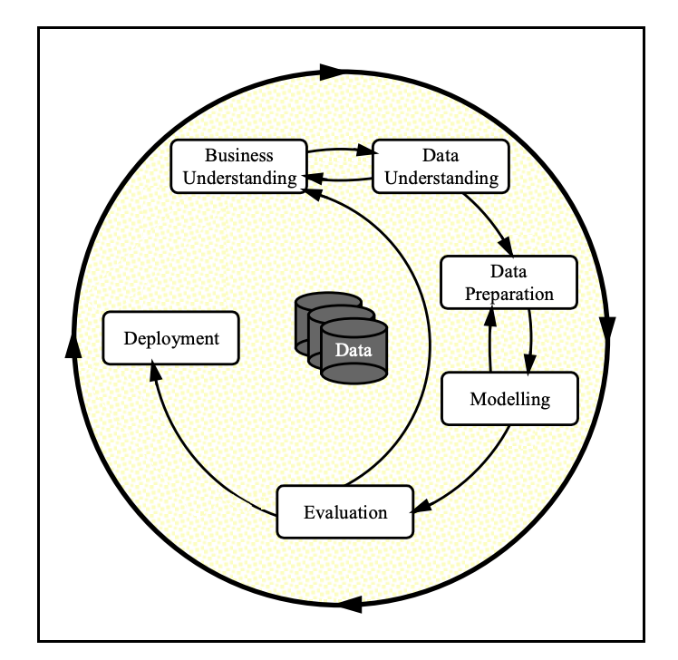

# Stroke Detection

** [Image Source](https://vitals.sutterhealth.org/stroke-and-heart-attack-rapid-response-timing-is-everything/)

**Author**

Sridhar Subramaniam

#### Executive summary
This projects explores building a best machine learning model that could diagnose the stroke using given patient data. By understanding Patient lifecycle, age and symptoms, this model could help doctors diagnose the stroke with better accuracy. This project involves the analysis of historical data, application of various regression models, and in-depth feature engineering and to provide actionable insights to both technical and non-technical stakeholders.

#### Rationale
Why should anyone care about this question?

Stroke need to diagnosed quickly to react and save patient's life. Machine learning can provide early automated diagnosis of stroke using patient's lifecycle, age and symptoms that enable Doctors to act quickly to save patient life. 

#### Research Question
What are you trying to answer?

Can regression & classification techniques detect the diagnosis of stroke based on patients data ?

#### Data Sources
What data will you use to answer you question?

In this exploration, a open data set for stroke predication from Kaggle is used. Can be downloaded [here](https://www.kaggle.com/datasets/teamincribo/stroke-prediction/).

#### Methodology
What methods are you using to answer the question?

Will be using the crisp-DM methodology.

#### Results
What did your research find?

#### Next steps
What suggestions do you have for next steps?

#### Outline of project

- [Link to notebook 1]()
- [Link to notebook 2]()
- [Link to notebook 3]()

##### Contact and Further Information